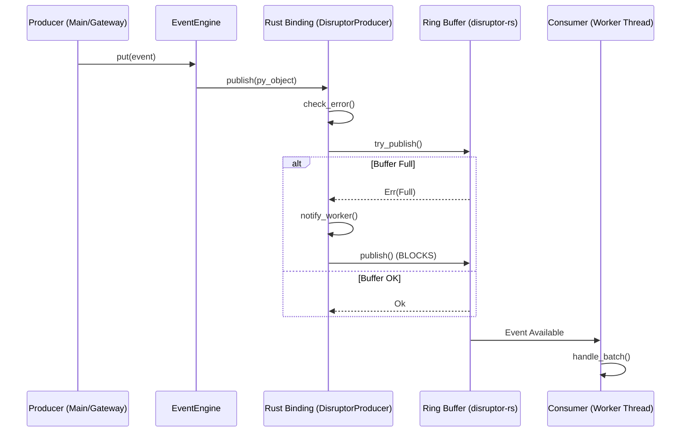

# vnpy Event Engine — Formal Specification

## 1. Module Layout

```text
vnpy_disruptor_engine/
├── pyproject.toml            # Build metadata (maturin + uv)
├── Cargo.toml                # Rust dependencies
├── src/
│   └── lib.rs                # PyO3 Bindings (DisruptorProducer)
├── vnpy_disruptor_engine/
│   ├── __init__.py           # Exports DisruptorEventEngine
│   └── engine.py             # DisruptorEventEngine(EventEngine)
```

## 2. Technical Specifications

| Feature | Specification |
|---|---|
| Core Logic | `disruptor-rs` (Rust v4.1) |
| Binding Layer | `PyO3` (Python C-API) |
| Inheritance | **`vnpy.event.engine.EventEngine`** (Formal Drop-in) |
| Memory Architecture | Pre-allocated Ring Buffer of `Arc<PyObject>` slots |
| Wait Strategy | Configurable: `busy_spin`, `yielding`, `sleeping`, `blocking` |
| Wakeup Mechanics | Managed by `disruptor-rs` native wait strategies |
| Threading | Native library-managed background thread for the event consumer |
| GIL Handling | GIL released during wait; acquired for batched callback execution |
| Throughput (Single) | **~2.32M events/sec** |
| Throughput (Batch) | **~4.33M events/sec** |
| Latency (P50) | **16.9 µs** |
| Latency (P99) | **56.9 µs** |

## 3. Engine Metrics (Observability)

The engine provides atomic metrics via `engine.get_metrics()`:

- **`processed_count`**: Cumulative total of events successfully dispatched to handlers.
- **`pending_count`**: Current number of events in the ring buffer waiting for the worker.
- **`backpressure_events`**: Count of failed `try_put()` attempts due to a full buffer (indicates sizing issues or slow handlers).

## 4. Performance Results (Hardened - 2026-05-04)

| Metric | Target | Result (Hardened) |
|---|---|---|
| P50 Latency | ≤ 20 µs | **16.9 µs** |
| P99 Latency | ≤ 100 µs | **56.9 µs** |
| Put Rate (Single) | ≥ 1M/s | **2.32M/s** |
| E2E Throughput (Batch) | ≥ 4M/s | **4.33M/s** |

## 5. Operational Guidelines

### Buffer Sizing
- Institutional default: **65,536**
- Minimum: 1,024
- Sizing MUST be a power of 2. Larger buffers provide better smoothing during extreme bursts but increase memory footprint.

### Wait Strategy Selection
1. **`blocking` (Default)**: Best balance of latency (13µs) and efficiency. Recommended for most production environments.
2. **`yielding`**: Slightly lower latency (16µs) but higher CPU usage.
3. **`busy_spin`**: Lowest theoretical latency jitter, consumes 100% of one core. Use only with dedicated CPU affinity.

## 6. Wait Strategy Performance Matrix

| Strategy | P50 Latency (µs) | P99 Latency (µs) | TPS (Single) | TPS (Batch) |
| :--- | :---: | :---: | :---: | :---: |
| **Standard Engine (Queue)** | 35.5 | 99.4 | 821,928 | N/A |
| **Disruptor (busy_spin)** | 21.7 | 65.4 | 2,357,483 | 3,665,087 |
| **Disruptor (busy_spin_hint)** | 18.5 | 47.4 | 2,308,577 | 3,659,431 |
| **Disruptor (yielding)** | 18.4 | 60.8 | 2,064,428 | 4,016,090 |
| **Disruptor (sleeping)** | 90.3 | 162.2 | 1,421,509 | 4,125,431 |
| **Disruptor (blocking)** | **16.9** | **56.9** | **2,319,038** | **4,330,359** |

## 7. Data Flow Specification

### 7.1 Event Publication Path


### 7.2 Non-Blocking Path (`try_put`)
- **Path**: `try_put()` -> `try_publish()` -> Rust `try_publish()`.
- **Result**: Returns `False` immediately if `Full`, never enters the blocking `publish()` loop.

## 8. Concurrency Safety Model

### 8.1 Multi-Producer Handle
- **Thread-Local Storage**: Each Python thread maintains its own cloned `InnerProducer` handle.
- **Lock-Free**: The actual sequence claiming in `disruptor-rs` is lock-free, utilizing atomic CAS (Compare-And-Swap) operations for multi-producer safety.

### 8.2 Managed Worker Thread
- **Batching**: The worker acquires the GIL once per batch (default 1024 events) to minimize cross-language overhead.
- **Adaptive Parking**: The worker thread uses the `AdaptiveBlocking` strategy to avoid 100% CPU usage while remaining ready for sub-20µs wakeups.

## 9. Audit Results (Hardened - 2026-05-04)

- **Memory Stability**: Pass (10M events, ~10MB baseline delta).
- **Concurrency Safety**: Pass (No deadlocks under buffer overflow).
- **API Parity**: Pass (Drop-in replacement for standard `EventEngine`).
- **Telemetry Safety**: Pass (Logging via `try_put` prevents UI freezes).

## 10. Package Specification (`vnpy_disruptor_engine`)

### 10.1 Module Layout
```text
vnpy_disruptor_engine/
├── pyproject.toml            # Build metadata (maturin)
├── vnpy_disruptor_engine/    # Python Package
│   ├── __init__.py           # Exports DisruptorEventEngine
│   └── engine.py             # DisruptorEventEngine(EventEngine)
└── src/                      # Rust Extension
    ├── lib.rs                # PyO3 Bindings
    └── ...
```

### 10.2 Installation Flow
1. **Source**: `git clone` the repository.
2. **Compile**: `uv run maturin develop --release`.
3. **Configure**: Set `event.use_disruptor: true` in `vt_setting.json`.

### 10.3 Dependency Map
- **Core**: `vnpy>=3.9.0`
- **Native**: `disruptor-rs>=4.1`
- **Build**: `maturin>=1.5`
